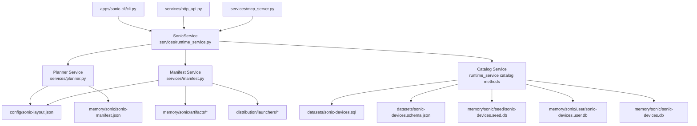

# Services: Overview

This page maps how Sonic service modules connect across CLI, HTTP, MCP, and
runtime storage surfaces.

## Integration Diagram

## Service Matrix

| Service | Primary Module | Inputs | Outputs | Primary Consumers |
|---|---|---|---|---|
| Planner | `services/planner.py` | repo root, USB target, layout, payload path, format mode | written manifest + dict response | CLI `plan`, HTTP `POST /api/sonic/plan`, MCP `sonic_plan` |
| Manifest | `services/manifest.py` | layout JSON + overrides + manifest payload | `SonicManifest`, validation report | planner, runtime health, HTTP/MCP verify routes |
| Device Catalog | `services/runtime_service.py` (catalog methods) | seed SQL, user overlay DB, filters | merged/paginated catalog + DB status/schema/export | HTTP device/db endpoints, MCP catalog tools, GUI summary |

## Entry Points

CLI:

- `plan`
- `serve-api`
- `serve-mcp`
- `run` (apply pipeline wrapper)

HTTP:

- `/api/sonic/*`
- `/api/platform/sonic/*` aliases

MCP tools:

- health, gui summary, devices, schema, db status/rebuild/bootstrap, plan, manifest verify

## Boundary Notes

- Planner and manifest services own planning contract and validation.
- Catalog service owns hardware metadata lifecycle and query overlay semantics.
- Disk apply execution remains outside these service modules.
